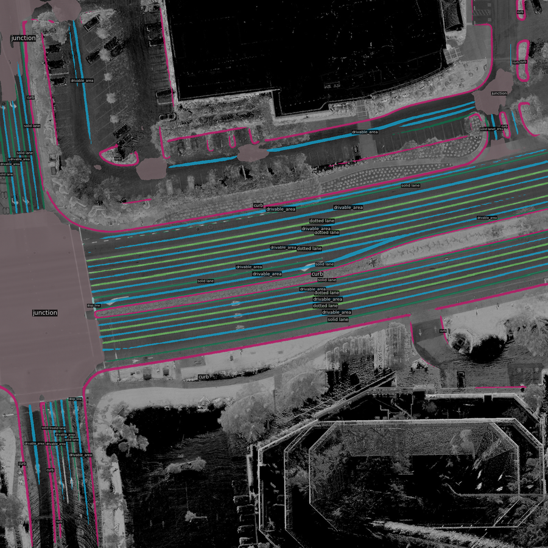
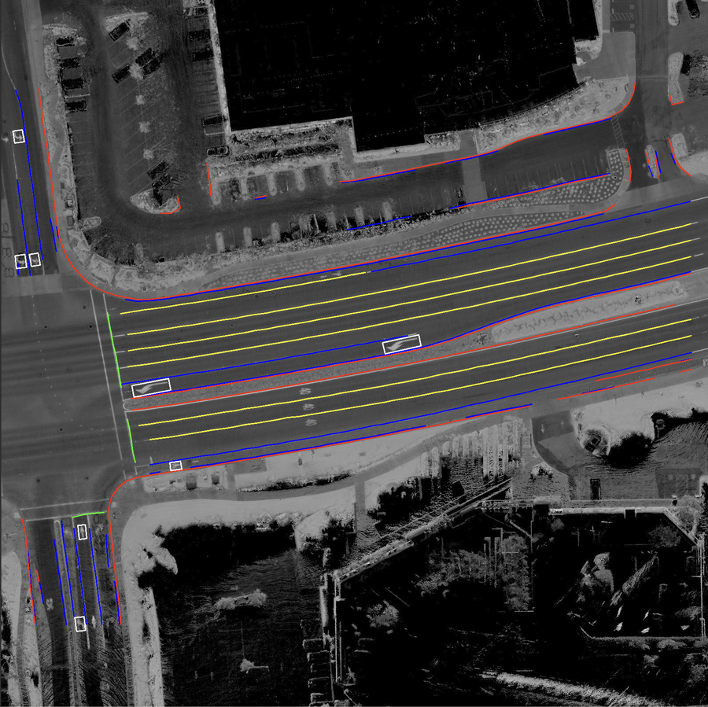

# OpenHdmapLab

OpenHdmapLab 是一个面向高精地图（HD Map）场景理解与要素提取的深度学习项目，集成了基于 Mask2Former 的实例/全景分割与地图要素预测流程，并提供推理与可视化工具，用于从图像中生成车道线、路沿、行人横道等地图语义结果。

## Model

核心模型为 `Mask2Map`，采用 Swin Transformer 作为骨干网络，并结合多尺度可变形注意力像素解码器。模型使用带有可学习查询的 Transformer 解码器生成实例/全景分割结果，并引入 LDAF 头学习距离-角度场以增强对细长结构地图要素的表达与恢复。推理结果通过自定义的 RotLocalVisualizer 与调色板进行可视化展示。

## Install

```bash
# 1) 创建环境
conda create -n openmmlab python=3.10 -y
conda activate openmmlab

# 2) 安装 PyTorch（CUDA 12.x）
pip install torch==2.4.0 torchvision torchaudio --index-url https://download.pytorch.org/whl/cu121

# 3) 安装 OpenMMLab 依赖
pip install -U openmim
mim install "mmcv>=2.0.0"
pip install mmengine mmdet

# 4) 其他依赖
pip install opencv-python

# 5) 安装本项目
pip install -e .
```

## Inference Example
```bash
cd mmhdmap
python projects/mask2former/tools/inference_single.py \
  --config projects/mask2former/configs/mask2former_swim_ldaf.py \
  --checkpoint data/mask2map_ckpts/rbbox.pth \
  --image_path projects/mask2former/tools/LosslessMap.jpg \
  --output_dir projects/mask2former/tools/
```

## Segmentation Result


## Skeletonizer Result
